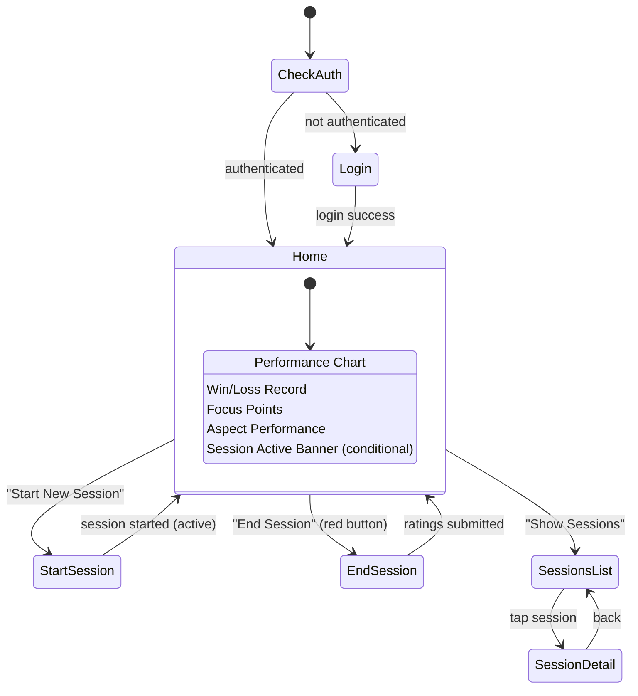
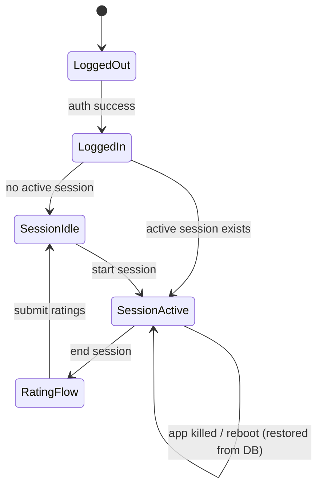
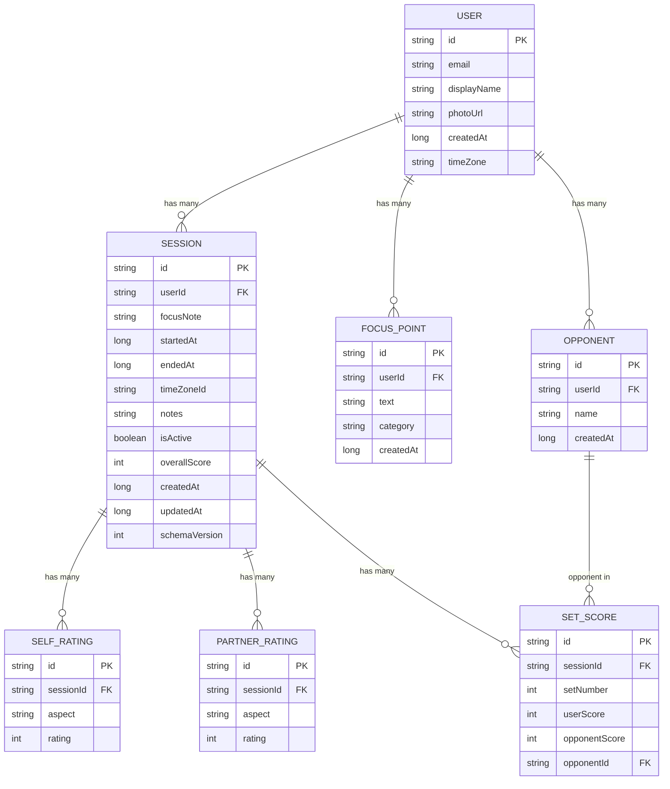

# Mindful Tennis — Implementation Plan

---

## 1) Product Summary

### Value Proposition

Mindful Tennis is a personal tennis journal and performance tracker that helps players of all levels log sessions, rate their technique across key aspects (forehand, backhand, serve, return, volley, slice, movement, mindset), track win/loss records, and visualize improvement trends over time. All data is backed up and synced to the cloud, ensuring players never lose their history and can access it across devices.

### Personas

| Persona | Description | Key Goals |
|---|---|---|
| **Casual Recreational Player** | Plays 1–3× per week for fun and fitness. Wants a lightweight way to note what they worked on and see if they're improving. | Quick session logging, simple trend view |
| **Competitive Club Player** | Competes in leagues/tournaments. Tracks set scores against specific opponents, aims to sharpen weak aspects. | Win/loss by opponent, aspect drilldown, partner ratings |
| **Coached Player** | Works with a coach who may review session notes. Wants detailed notes and structured focus points. | Rich notes, focus points, exportable data (nice-to-have) |

### Primary User Journeys

```
Login → Dashboard (Home) → Start Session → (Play Tennis — app in background, notification active)
→ End Session → Rate Aspects (self + optional partner) → Enter Set Scores → Submit → Dashboard
                                                                                      ↓
                                                                              View Sessions List
                                                                              View Performance Charts
                                                                              Manage Focus Points
```

---

## 2) MVP Scope vs Nice-to-Have

### MVP (all requirements covered)

- [x] Supabase Auth login (Google Sign-In) on first install
- [x] Home/Dashboard with:
  - Performance line chart with duration filter (1W / 1M / 3M / 6M / 1Y / custom)
  - Win/Loss record with duration + opponent multi-select filter
  - Scrollable Focus Points list
  - Aspect performance cards (8 aspects) with time-period filter
  - "Show Sessions" button → color-coded session list
  - "Start New Session" button
- [x] Start Session screen (header text, focus note input, CTA)
- [x] Active session behavior: navigate to Home, red "End Session" button, ongoing notification
- [x] End Session → Rating screen: star ratings (1–5) for 8 aspects, comment box, optional partner ratings, set score entry
- [x] Cloud backup & multi-device sync (Supabase)
- [x] Foreground service notification during active session

### Nice-to-Have (Post-MVP)

| Feature | Priority | Notes |
|---|---|---|
| Export/Share session PDF | Medium | Generate a shareable session summary |
| Practice reminders (scheduled notifications) | Medium | Nudge to play regularly |
| Streak tracking | Low | Gamification: consecutive days/weeks played |
| Session templates | Medium | Pre-fill focus points from a saved template |
| Focus-point tags & categories | Low | Organize focus points (e.g., "Technique", "Mental") |
| Full-text search across sessions | Medium | Search notes, focus points |
| Offline-first with conflict UI | Low | Show conflict dialog instead of silent merge |
| Coach sharing / read-only link | Low | Share dashboard with a coach |
| Widget (home screen) | Low | Quick-start session, show streak |
| Dark/Light theme toggle | Low | Material 3 dynamic color already supports this |
| Opponent profile management | Medium | Add/edit opponent details |
| Drill / match type tagging | Medium | Distinguish practice vs match sessions |

---

## 3) Information Architecture & Navigation

### Screens

| Route | Screen | Auth Required | Args |
|---|---|---|---|
| `login` | Login / Onboarding | No | — |
| `home` | Dashboard (Home) | Yes | — |
| `start_session` | Start New Session | Yes | — |
| `end_session/{sessionId}` | Session Rating | Yes | `sessionId: String` |
| `sessions_list` | Sessions List (color-coded) | Yes | — |
| `session_detail/{sessionId}` | Session Detail | Yes | `sessionId: String` |

### Navigation Graph (Mermaid)



### Key State Transitions



### Compose Navigation Integration

- Use `androidx.navigation:navigation-compose` (added dependency).
- Single `NavHost` in `MainActivity` with a sealed `Route` class.
- Auth state observed from `AuthRepository`; `NavHost` `startDestination` is `login` or `home` based on auth.
- Deep link: notification "End Session" action deep-links to `end_session/{sessionId}`.
- Arguments passed via `NavType.StringType` for `sessionId`.

```kotlin
// Route definitions (sealed class)
sealed class Route(val route: String) {
    data object Login : Route("login")
    data object Home : Route("home")
    data object StartSession : Route("start_session")
    data class EndSession(val sessionId: String) : Route("end_session/$sessionId") {
        companion object {
            const val ROUTE_PATTERN = "end_session/{sessionId}"
        }
    }
    data object SessionsList : Route("sessions_list")
    data class SessionDetail(val sessionId: String) : Route("session_detail/$sessionId") {
        companion object {
            const val ROUTE_PATTERN = "session_detail/{sessionId}"
        }
    }
}
```

---

## 4) UI/UX Spec (Clean Material 3)

### Design System

#### Spacing

| Token | Value | Usage |
|---|---|---|
| `xs` | 4 dp | Inline icon gaps |
| `sm` | 8 dp | Between related elements |
| `md` | 16 dp | Content padding, card internal padding |
| `lg` | 24 dp | Between sections |
| `xl` | 32 dp | Screen edge top/bottom margins |

#### Typography (Material 3 type scale)

| Element | Style |
|---|---|
| Screen title | `headlineMedium` |
| Section heading | `titleMedium` |
| Card title | `titleSmall` |
| Body text | `bodyMedium` |
| Label / caption | `labelSmall` |
| Button | `labelLarge` |
| Chart axis labels | `labelSmall` |

#### Color

| Semantic | Token | Notes |
|---|---|---|
| Primary | `MaterialTheme.colorScheme.primary` | Buttons, active chart line |
| Secondary | `MaterialTheme.colorScheme.secondary` | Accent, focus point chips |
| Error / Red | `MaterialTheme.colorScheme.error` | "End Session" button background when session active |
| Surface | `MaterialTheme.colorScheme.surface` | Card backgrounds |
| Session Good | Custom `#4CAF50` (green) | Session list item score ≥ 70 |
| Session OK | Custom `#FF9800` (amber) | Session list item score 40–69 |
| Session Poor | Custom `#F44336` (red) | Session list item score < 40 |

---

### Screen Specs

#### 4.1 Login Screen

```
┌─────────────────────────┐
│                         │
│      🎾 App Logo        │
│   "Mindful Tennis"      │
│                         │
│  Track your tennis      │
│  journey, one session   │
│  at a time.             │
│                         │
│  ┌───────────────────┐  │
│  │ Sign in with      │  │
│  │ Google       [G]  │  │
│  └───────────────────┘  │
│                         │
│  By signing in you      │
│  agree to our Terms     │
│  & Privacy Policy.      │
│                         │
└─────────────────────────┘
```

- **Scaffold**: No top bar. Centered content column.
- **Components**: App icon/illustration, tagline text, Google Sign-In button (Material 3 `OutlinedButton` with Google icon), legal links.
- **Empty state**: N/A.
- **Loading state**: Sign-in button shows `CircularProgressIndicator` after tap; disable button.
- **Error state**: `Snackbar` at bottom with error message + "Retry" action.
- **Accessibility**: Button has content description "Sign in with Google". Min touch target 48 dp.

---

#### 4.2 Home / Dashboard

```
┌──────────────────────────────┐
│ ◀ (no back)  "Dashboard"  ⚙ │  ← TopAppBar (settings gear)
├──────────────────────────────┤
│ ┌──────────────────────────┐ │
│ │ Performance Trend        │ │  ← Card
│ │ [1W][1M][3M][6M][1Y][…] │ │  ← FilterChipRow
│ │ ╭─────────────╮          │ │
│ │ │  Line Chart  │          │ │
│ │ ╰─────────────╯          │ │
│ └──────────────────────────┘ │
│ ┌──────────────────────────┐ │
│ │ Win / Loss               │ │  ← Card
│ │ Filter: 1M | Opponents ▼ │ │
│ │    W: 12  L: 5  (70.6%)  │ │
│ └──────────────────────────┘ │
│ ┌──────────────────────────┐ │
│ │ Focus Points             │ │  ← Card
│ │ ┌─────┐ ┌──────┐ ┌────┐ │ │
│ │ │Topspin│Keep calm│Move │ │ │  ← Scrollable chips
│ │ └─────┘ └──────┘ └────┘ │ │
│ └──────────────────────────┘ │
│ ┌──────────────────────────┐ │
│ │ Aspect Performance       │ │  ← Card
│ │ Filter: 1M               │ │
│ │ Forehand ★★★★☆  4.1      │ │
│ │ Backhand ★★★☆☆  3.2      │ │
│ │ Serve    ★★★★☆  3.8      │ │
│ │ …                        │ │
│ └──────────────────────────┘ │
│                              │
│  ┌────────────────────────┐  │
│  │   Show Sessions        │  │  ← OutlinedButton
│  └────────────────────────┘  │
│  ┌────────────────────────┐  │
│  │  Start New Session     │  │  ← FilledButton (primary) OR
│  │  End Session (RED)     │  │  ← FilledButton (error) if active
│  └────────────────────────┘  │
└──────────────────────────────┘
```

- **Scaffold**: `TopAppBar` ("Dashboard" title, settings icon). Scrollable `LazyColumn` body. Bottom persistent button area (not a BottomBar — use `Column` with weight).
- **Components**: `ElevatedCard` per section, `FilterChip` rows for duration, `LazyRow` for focus chips, `Row` for each aspect with star bar + numeric label.
- **Empty states**:
  - No sessions yet: chart area shows illustration + "Log your first session to see trends."
  - No focus points: "Add focus points when you start a session."
  - No opponents for filter: multi-select shows "No opponents recorded yet."
- **Loading state**: `Shimmer` placeholder for each card while data loads.
- **Error state**: Individual card shows inline error text + "Retry" button.
- **Accessibility**: Chart has content description summarizing trend ("Performance trending up over last month, average 72"). Each aspect row readable by TalkBack. Touch targets ≥ 48 dp for filter chips.

---

#### 4.3 Start Session Screen

```
┌──────────────────────────────┐
│ ← Back       "New Session"   │
├──────────────────────────────┤
│                              │
│  "All the best for this     │
│   session."                  │
│                              │
│  ┌──────────────────────┐    │
│  │ What do you want to  │    │
│  │ work on today?       │    │  ← OutlinedTextField (multiline)
│  │                      │    │
│  └──────────────────────┘    │
│                              │
│  Recent Focus Points:        │
│  ┌─────┐ ┌──────┐ ┌────┐    │  ← Tappable chips (auto-fill)
│  │Topspin│Keep calm│Move │    │
│  └─────┘ └──────┘ └────┘    │
│                              │
│  ┌────────────────────────┐  │
│  │    Start Session ▶     │  │  ← FilledButton (primary)
│  └────────────────────────┘  │
│                              │
└──────────────────────────────┘
```

- **Scaffold**: `TopAppBar` with back arrow + title.
- **Components**: Header text (`headlineMedium`), `OutlinedTextField` (multiline, max 500 chars), chip row of recent focus points (tap to prepopulate), primary button.
- **Loading**: Button shows spinner while creating session document.
- **Error**: Snackbar.
- **Accessibility**: Text field labeled "Session focus note".

---

#### 4.4 Active Session (Home Variant)

- Dashboard appears identical except:
  - **Bottom button** changes to **"End Session"** with `containerColor = MaterialTheme.colorScheme.error` (red).
  - An **info banner** below TopAppBar: "Session in progress — started at 3:45 PM" with elapsed timer text.
- Notification is visible in system tray (see §8).

---

#### 4.5 End Session / Rating Screen

```
┌──────────────────────────────────┐
│ ← Back     "Rate Your Session"   │
├──────────────────────────────────┤
│                                  │
│  Session: Mar 4, 3:45 – 5:12 PM │
│  Focus: "Work on slice backhand" │
│                                  │
│ ── Your Ratings ──────────────── │
│  Forehand    ☆ ☆ ☆ ☆ ☆          │
│  Backhand    ☆ ☆ ☆ ☆ ☆          │
│  Serve       ☆ ☆ ☆ ☆ ☆          │
│  Return      ☆ ☆ ☆ ☆ ☆          │
│  Volley      ☆ ☆ ☆ ☆ ☆          │
│  Slice       ☆ ☆ ☆ ☆ ☆          │
│  Movement    ☆ ☆ ☆ ☆ ☆          │
│  Mindset     ☆ ☆ ☆ ☆ ☆          │
│                                  │
│  ┌──────────────────────────┐    │
│  │ Notes / comments         │    │
│  │                          │    │
│  └──────────────────────────┘    │
│                                  │
│ ── Partner Ratings (optional) ── │
│  ▶ Add Partner Ratings           │  ← Expandable section
│   (same 8 aspects if expanded)   │
│                                  │
│ ── Set Scores ─────────────────  │
│  ▶ Add Set Scores                │  ← Expandable section
│   Set 1: [___] - [___]          │
│   Set 2: [___] - [___]          │
│   + Add Set                      │
│                                  │
│  ┌────────────────────────────┐  │
│  │      Submit Session        │  │
│  └────────────────────────────┘  │
└──────────────────────────────────┘
```

- **Scaffold**: `TopAppBar` with back + title. Scrollable `LazyColumn`.
- **Components**: Session metadata header, 8× star-rating rows (custom `StarRatingBar` composable, tappable stars), `OutlinedTextField` for notes, expandable `ListItem` for partner section, expandable set-scores section with dynamic row add.
- **Star Rating**: Each star is 40 dp touch target. Half-star not in MVP. Selected stars filled with `primary` color.
- **Set Scores**: Two `OutlinedTextField` (numeric keyboard) per set, side-by-side. "Add Set" button. Remove set via trailing icon.
- **Validation**: At least one self-rating required. Set scores optional. Show inline error if submit attempted with no ratings.
- **Loading**: Submit button shows spinner.
- **Error**: Snackbar for save failure.
- **Accessibility**: Star rows: "Forehand rating, 3 out of 5 stars" announced. Stars selectable via d-pad/keyboard.

---

#### 4.6 Sessions List Screen

```
┌──────────────────────────────────┐
│ ← Back       "Sessions"          │
├──────────────────────────────────┤
│  Filter: [1M ▾]                  │
│                                  │
│  ┌─ 🟢 ────────────────────────┐ │
│  │ Mar 3, 2026 • 1h 27m        │ │
│  │ Score: 82 • W 6-3 6-4       │ │
│  │ Focus: Slice backhand        │ │
│  └──────────────────────────────┘ │
│  ┌─ 🟡 ────────────────────────┐ │
│  │ Mar 1, 2026 • 0h 55m        │ │
│  │ Score: 58 • L 4-6 6-7       │ │
│  │ Focus: Serve toss            │ │
│  └──────────────────────────────┘ │
│  ┌─ 🔴 ────────────────────────┐ │
│  │ Feb 27, 2026 • 1h 10m       │ │
│  │ Score: 35                    │ │
│  │ Focus: Movement drills       │ │
│  └──────────────────────────────┘ │
│  …                               │
└──────────────────────────────────┘
```

- Color strip on left of each card (see §10).
- Empty state: "No sessions yet. Start your first session from the Dashboard."
- Pagination: load 20 at a time, load more on scroll.

---

#### 4.7 Session Detail Screen

- Full read-only view of a submitted session (all ratings, notes, set scores, partner ratings).
- Option to edit (nice-to-have, not MVP).

---

## 5) Data Model (Local + Cloud)

### Entities

#### User

| Field | Type | Notes |
|---|---|---|
| `id` | `String` (Supabase Auth UID) | PK |
| `email` | `String` | From auth |
| `displayName` | `String?` | From auth |
| `photoUrl` | `String?` | From auth |
| `createdAt` | `Long` (epoch ms) | Account creation |
| `timeZone` | `String` | IANA tz id, e.g. `America/New_York` |

#### Session

| Field | Type | Notes |
|---|---|---|
| `id` | `String` (UUID) | PK |
| `userId` | `String` | FK → User |
| `focusNote` | `String` | What user wants to work on |
| `startedAt` | `Long` (epoch ms) | Session start |
| `endedAt` | `Long?` (epoch ms) | Null while active |
| `timeZoneId` | `String` | TZ at start |
| `notes` | `String?` | Post-session comment |
| `isActive` | `Boolean` | True while in progress |
| `overallScore` | `Int?` | Derived 0–100 composite |
| `createdAt` | `Long` | Document created |
| `updatedAt` | `Long` | Last modification |
| `schemaVersion` | `Int` | Default `1` |

#### SelfRating

| Field | Type | Notes |
|---|---|---|
| `id` | `String` (UUID) | PK |
| `sessionId` | `String` | FK → Session |
| `aspect` | `String` (enum) | One of 8 aspects |
| `rating` | `Int` | 1–5 |

#### PartnerRating

| Field | Type | Notes |
|---|---|---|
| `id` | `String` (UUID) | PK |
| `sessionId` | `String` | FK → Session |
| `aspect` | `String` (enum) | One of 8 aspects |
| `rating` | `Int` | 1–5 |

#### FocusPoint

| Field | Type | Notes |
|---|---|---|
| `id` | `String` (UUID) | PK |
| `userId` | `String` | FK → User |
| `text` | `String` | e.g., "Stay low on volleys" |
| `category` | `String?` | Optional tag (nice-to-have) |
| `createdAt` | `Long` | |

#### Opponent

| Field | Type | Notes |
|---|---|---|
| `id` | `String` (UUID) | PK |
| `userId` | `String` | FK → User |
| `name` | `String` | Display name |
| `createdAt` | `Long` | |

#### SetScore

| Field | Type | Notes |
|---|---|---|
| `id` | `String` (UUID) | PK |
| `sessionId` | `String` | FK → Session |
| `setNumber` | `Int` | 1, 2, 3… |
| `userScore` | `Int` | Games won |
| `opponentScore` | `Int` | Games lost |
| `opponentId` | `String?` | FK → Opponent (nullable for unnamed) |

### Aspect Enum

```kotlin
enum class Aspect {
    FOREHAND, BACKHAND, SERVE, RETURN, VOLLEY, SLICE, MOVEMENT, MINDSET
}
```

### Derived Metrics

| Metric | Derivation |
|---|---|
| **Overall Score** | Mean of 8 self-ratings, normalized to 0–100: `(mean - 1) / 4 * 100` |
| **Win/Loss** | A session is a "win" if majority of sets have `userScore > opponentScore`. If no sets recorded, excluded from W/L. |
| **Performance Trend** | Time-series of `overallScore` per session, plotted on line chart. |
| **Aspect Averages** | Mean rating per aspect over filtered date range. |

### ER Diagram



### Versioning Strategy

- Each document/entity has a `schemaVersion` field (default `1`).
- On app update, a Room migration or Supabase migration function checks the version and transforms data if needed.
- Room: standard `Migration(oldVersion, newVersion)` objects.
- Supabase: SQL migration applied via Supabase dashboard or CLI; lazy migration at client on deserialize.

### Data Retention & Deletion

- User-initiated account deletion: wipe all Supabase rows for user (`DELETE FROM ... WHERE user_id = {uid}`) + clear local Room DB.
- Session delete: soft-delete (set `deletedAt` timestamp), hard-delete after 30 days via cloud function.
- Comply with Google Play data-deletion requirements.

### Example JSON (Supabase Row)

**Session document** (`sessions` table row):

```json
{
  "id": "a1b2c3d4-e5f6-7890-abcd-ef1234567890",
  "userId": "supabase-uid-123",
  "focusNote": "Work on slice backhand approach shots",
  "startedAt": 1741100700000,
  "endedAt": 1741106100000,
  "timeZoneId": "America/New_York",
  "notes": "Felt good after first set, tired in second",
  "isActive": false,
  "overallScore": 72,
  "createdAt": 1741100700000,
  "updatedAt": 1741106200000,
  "schemaVersion": 1,
  "selfRatings": [
    { "aspect": "FOREHAND", "rating": 4 },
    { "aspect": "BACKHAND", "rating": 3 },
    { "aspect": "SERVE", "rating": 4 },
    { "aspect": "RETURN", "rating": 3 },
    { "aspect": "VOLLEY", "rating": 3 },
    { "aspect": "SLICE", "rating": 4 },
    { "aspect": "MOVEMENT", "rating": 4 },
    { "aspect": "MINDSET", "rating": 4 }
  ],
  "partnerRatings": [
    { "aspect": "FOREHAND", "rating": 3 },
    { "aspect": "BACKHAND", "rating": 3 }
  ],
  "setScores": [
    { "setNumber": 1, "userScore": 6, "opponentScore": 3, "opponentId": "opp-uuid-1" },
    { "setNumber": 2, "userScore": 6, "opponentScore": 4, "opponentId": "opp-uuid-1" }
  ]
}
```

---

## 6) Architecture Plan (Android)

### Architecture Style: MVVM + Unidirectional Data Flow (UDF)

Each screen follows:

```
UI (Composable) ← observes → ViewModel (StateFlow<UiState>) → Repository → DataSource (Room / Supabase)
                   emits events ↑                                ↓ suspending calls
```

### Module / Package Structure

```
com.ashutosh.mindfultennis/
├── MindfulTennisApp.kt            // Application class
├── MainActivity.kt                 // Single activity, NavHost
├── navigation/
│   ├── NavGraph.kt                 // NavHost setup
│   └── Route.kt                    // Sealed route definitions
├── di/
│   ├── AppModule.kt                // Hilt @Module: Room, Supabase Client, DataStore
│   ├── RepositoryModule.kt         // Hilt @Binds for repository impls
│   └── ServiceModule.kt            // Hilt bindings for notification/services
├── data/
│   ├── local/
│   │   ├── db/
│   │   │   ├── MindfulDatabase.kt  // Room database
│   │   │   ├── dao/
│   │   │   │   ├── SessionDao.kt
│   │   │   │   ├── RatingDao.kt
│   │   │   │   ├── FocusPointDao.kt
│   │   │   │   ├── OpponentDao.kt
│   │   │   │   └── SetScoreDao.kt
│   │   │   └── entity/             // Room @Entity classes
│   │   │       ├── SessionEntity.kt
│   │   │       ├── SelfRatingEntity.kt
│   │   │       ├── PartnerRatingEntity.kt
│   │   │       ├── FocusPointEntity.kt
│   │   │       ├── OpponentEntity.kt
│   │   │       └── SetScoreEntity.kt
│   │   └── datastore/
│   │       └── UserPreferences.kt  // DataStore for prefs (auth token cache, UI prefs)
│   ├── remote/
│   │   ├── SupabaseSessionDataSource.kt
│   │   ├── SupabaseUserDataSource.kt
│   │   └── model/                  // Supabase DTOs (@Serializable)
│   │       └── SessionDto.kt
│   ├── repository/
│   │   ├── AuthRepository.kt       // Interface
│   │   ├── AuthRepositoryImpl.kt
│   │   ├── SessionRepository.kt    // Interface
│   │   ├── SessionRepositoryImpl.kt
│   │   ├── FocusPointRepository.kt
│   │   ├── FocusPointRepositoryImpl.kt
│   │   ├── OpponentRepository.kt
│   │   └── OpponentRepositoryImpl.kt
│   └── sync/
│       ├── SyncManager.kt          // Orchestrates local ↔ cloud sync
│       └── SyncWorker.kt           // WorkManager periodic sync
├── domain/
│   ├── model/                      // Domain models (clean, no annotations)
│   │   ├── Session.kt
│   │   ├── Rating.kt
│   │   ├── FocusPoint.kt
│   │   ├── Opponent.kt
│   │   ├── SetScore.kt
│   │   ├── Aspect.kt
│   │   └── PerformanceTrend.kt
│   └── usecase/
│       ├── StartSessionUseCase.kt
│       ├── EndSessionUseCase.kt
│       ├── SubmitRatingsUseCase.kt
│       ├── GetPerformanceTrendUseCase.kt
│       ├── GetWinLossRecordUseCase.kt
│       ├── GetAspectAveragesUseCase.kt
│       └── GetSessionsUseCase.kt
├── ui/
│   ├── login/
│   │   ├── LoginScreen.kt
│   │   └── LoginViewModel.kt
│   ├── home/
│   │   ├── HomeScreen.kt
│   │   ├── HomeViewModel.kt
│   │   └── components/
│   │       ├── PerformanceChart.kt
│   │       ├── WinLossCard.kt
│   │       ├── FocusPointsRow.kt
│   │       ├── AspectPerformanceCard.kt
│   │       └── DurationFilterChips.kt
│   ├── startsession/
│   │   ├── StartSessionScreen.kt
│   │   └── StartSessionViewModel.kt
│   ├── endsession/
│   │   ├── EndSessionScreen.kt
│   │   ├── EndSessionViewModel.kt
│   │   └── components/
│   │       ├── StarRatingBar.kt
│   │       ├── SetScoreInput.kt
│   │       └── PartnerRatingSection.kt
│   ├── sessions/
│   │   ├── SessionsListScreen.kt
│   │   ├── SessionsListViewModel.kt
│   │   ├── SessionDetailScreen.kt
│   │   └── SessionDetailViewModel.kt
│   └── components/                 // Shared composables
│       ├── LoadingShimmer.kt
│       ├── ErrorRetryCard.kt
│       └── SessionColorIndicator.kt
├── service/
│   └── ActiveSessionService.kt    // Foreground service
├── notification/
│   └── SessionNotificationManager.kt
└── util/
    ├── DateTimeUtils.kt
    ├── ScoreCalculator.kt
    └── Extensions.kt
```

### State Management (per screen example — Home)

```kotlin
// HomeUiState.kt
data class HomeUiState(
    val isLoading: Boolean = true,
    val performanceTrend: List<TrendPoint> = emptyList(),
    val selectedDuration: Duration = Duration.ONE_MONTH,
    val winLossRecord: WinLossRecord? = null,
    val focusPoints: List<FocusPoint> = emptyList(),
    val aspectAverages: Map<Aspect, Float> = emptyMap(),
    val activeSession: Session? = null,
    val error: String? = null
)

// HomeUiEvent.kt
sealed interface HomeUiEvent {
    data class DurationChanged(val duration: Duration) : HomeUiEvent
    data class OpponentFilterChanged(val ids: Set<String>) : HomeUiEvent
    data object StartSessionClicked : HomeUiEvent
    data object EndSessionClicked : HomeUiEvent
    data object RetryClicked : HomeUiEvent
}
```

### Repository Pattern

```
ViewModel → UseCase (optional) → Repository (interface) → DataSource (Room + Supabase)
```

- **Repository** abstracts the data source. Reads prefer local (Room) for speed; writes go to local first, then sync to Supabase via `SyncManager`.
- **UseCase**: thin orchestrators for complex business logic (e.g., `SubmitRatingsUseCase` writes ratings + updates session + calculates score + triggers sync).

### Dependency Injection: Hilt

> **Added dependency**: `com.google.dagger:hilt-android` + `hilt-compiler` (KSP), `androidx.hilt:hilt-navigation-compose`.

**Justification**: Hilt is the Google-recommended DI for Android, integrates natively with ViewModel, WorkManager, and Compose Navigation. Minimal boilerplate vs manual DI.

### Offline-First Strategy

1. All writes go to **Room first** (single source of truth for UI).
2. A `SyncManager` observes pending changes (Room column `syncStatus: PENDING | SYNCED | CONFLICT`) and pushes to Supabase.
3. `WorkManager` schedules periodic sync (every 15 min) + on network-available constraint.
4. On login / app start, pull latest from Supabase and merge into Room (see §7 for conflict resolution).
5. Supabase Realtime channels provide real-time updates when app is in foreground on another device.

---

## 7) Persistence & Sync

### Local Storage

> **Added dependencies**:
> - `androidx.room:room-runtime`, `room-ktx`, `room-compiler` (KSP)
> - `androidx.datastore:datastore-preferences`
> - `androidx.work:work-runtime-ktx`

| Store | What | Why |
|---|---|---|
| **Room** | Sessions, Ratings, FocusPoints, Opponents, SetScores | Structured relational data, complex queries, offline-first |
| **DataStore (Preferences)** | Auth state cache, selected filters, last sync timestamp, UI preferences | Simple key-value, no schema needed |

### Cloud Storage: Supabase (Free Tier)

#### Supabase Auth + Supabase Postgres (✅ CHOSEN)

| Component | Service |
|---|---|
| Auth | Supabase Auth (Google OAuth provider) |
| Database | Supabase Postgres (via PostgREST API) |
| Realtime | Supabase Realtime (Postgres changes → WebSocket) |
| Sync | Room (offline-first) + custom SyncWorker → Supabase |

> **Added dependencies** (`libs.versions.toml`):
> - `io.github.jan-tennert.supabase:bom` (BOM)
> - `supabase:auth-kt`
> - `supabase:postgrest-kt`
> - `supabase:realtime-kt`
> - `io.ktor:ktor-client-okhttp`
> - `org.jetbrains.kotlinx:kotlinx-serialization-json`

**Supabase Table Structure**:

```
users               → User profile (id = Supabase Auth UID, PK)
sessions            → Session rows (user_id FK → users.id)
self_ratings        → Self-rating rows (session_id FK → sessions.id)
partner_ratings     → Partner-rating rows (session_id FK → sessions.id)
focus_points        → Focus point rows (user_id FK → users.id)
opponents           → Opponent rows (user_id FK → users.id)
set_scores          → Set score rows (session_id FK → sessions.id)
```

**Why chosen**: Free tier provides 500 MB Postgres database, 50K monthly active users auth, built-in Google OAuth, Realtime subscriptions, and Row Level Security. No Firebase dependency. Kotlin multiplatform SDK (`supabase-kt`) provides type-safe API. Fastest path to MVP with full relational DB.

### Conflict Resolution

**Strategy: Last-Write-Wins (LWW) per row, with field-level merge for sessions.**

Rules:
1. Each row has an `updated_at` timestamp (client-generated, with Postgres `now()` on server write).
2. On sync pull: if remote `updatedAt` > local `updatedAt`, overwrite local.
3. On sync push: if remote `updatedAt` > local `updatedAt`, pull remote first, then re-apply local changes (field merge).
4. **Field-level merge for Session**: ratings, notes, and setScores arrays are merged individually. If both sides edited the same aspect rating, latest `updatedAt` wins.
5. Deletes are handled via soft-delete (`deletedAt` timestamp). A deleted document is never resurrected.

### Authentication / Session Handling

1. Supabase Auth token refreshed automatically by the SDK.
2. On app start, check `supabase.auth.currentSessionOrNull()`. If null → navigate to Login.
3. Auth state listener in `AuthRepository` emits `Flow<AuthState>` (sealed: `Authenticated(user)`, `Unauthenticated`, `Loading`).
4. On sign-out: clear Room, clear DataStore, navigate to Login.

### Multi-Device Sync

1. Supabase Realtime channel on `sessions` table (filtered by `user_id`) — updates flow into Room via repository.
2. On each app launch, `SyncWorker` does a full reconciliation (pull remote, merge, push pending local).
3. Active session: only one device can have an active session. On start, write `is_active=true` to Supabase immediately. If another device detects an active session on pull, show dialog: "Active session on another device. Take over?"

---

## 8) Notifications (Active Session)

### Approach: Foreground Service + Ongoing Notification

> **Rationale**: A foreground service is required for reliable long-running operations on Android 10+. The notification is ongoing (cannot be swiped away), ensuring the user always has a path back. WorkManager alone won't keep the process alive for elapsed-time tracking.

### Implementation

```kotlin
class ActiveSessionService : Service() {
    // Creates a foreground notification with:
    // - Title: "Mindful Tennis — Session Active"
    // - Body: "Started at 3:45 PM • 1h 27m elapsed"
    // - Action: "End Session" (PendingIntent deep-links to end_session/{sessionId})
    // - Ongoing: true (not dismissible)
    // - Channel: "active_session" (importance: LOW — no sound, just visual)
}
```

### Lifecycle

| Event | Action |
|---|---|
| User taps "Start Session" | Create session in Room (isActive=true), start `ActiveSessionService`, navigate to Home |
| User taps "End Session" | Stop `ActiveSessionService`, navigate to Rating screen |
| User taps notification action | Deep-link to `end_session/{sessionId}` |
| App killed by system | Service restarted (`START_STICKY`); on restart, check Room for active session and rebuild notification |
| Phone reboot | `BOOT_COMPLETED` receiver checks Room for active session, restarts service if found |
| Timezone change | Elapsed time is computed from `startedAt` (epoch ms), unaffected by TZ. Display updates on next tick. |

### Notification Channel Setup

```kotlin
NotificationChannel(
    "active_session",
    "Active Session",
    NotificationManager.IMPORTANCE_LOW  // No sound, shows in tray
).apply {
    description = "Shows while a tennis session is in progress"
    setShowBadge(true)
}
```

### Permissions

- `FOREGROUND_SERVICE` + `FOREGROUND_SERVICE_SPECIAL_USE` (Android 14+).
- `POST_NOTIFICATIONS` runtime permission (Android 13+).
- `RECEIVE_BOOT_COMPLETED` for reboot recovery.

---

## 9) Charts & Analytics UI

### Charting Library

> **Added dependency**: `io.github.ehsannarmani:compose-charts:0.1.1` (or latest)

**Justification**: Lightweight, Compose-native charting library. Supports line charts with animation, customizable styling, and is simpler than Vico or MPAndroidChart (which are View-based). If this library is insufficient, fallback is a custom `Canvas` composable — line charts are straightforward with `drawLine` + `drawCircle`.

**Alternative considered**: [Vico](https://github.com/patrykandpatrick/vico) — more mature but heavier. Good fallback if `compose-charts` lacks features.

### Performance Score Definition

$$
\text{overallScore} = \frac{\left(\frac{\sum_{i=1}^{8} r_i}{8}\right) - 1}{4} \times 100
$$

Where $r_i$ is the star rating (1–5) for each of the 8 aspects. Result is an integer from 0 to 100.

| Raw Mean | Score |
|---|---|
| 1.0 | 0 |
| 2.0 | 25 |
| 3.0 | 50 |
| 4.0 | 75 |
| 5.0 | 100 |

### Filters

| Filter | Type | Default | Options |
|---|---|---|---|
| Duration | Single-select chip row | 1M | 1W, 1M, 3M, 6M, 1Y, Custom (date picker) |
| Opponent | Multi-select bottom sheet | All | List of opponents from Room |

### Aggregation Rules

- **Chart data points**: one point per session (not aggregated by day/week). If >50 points visible, auto-aggregate to weekly average.
- **Win/Loss**: count of sessions with majority-set-wins vs losses over filtered period.
- **Aspect averages**: arithmetic mean of each aspect's ratings over filtered sessions.

### Chart Design

- Line chart: single line, primary color, filled area underneath with 10% opacity.
- X-axis: date labels (auto-spaced). Y-axis: 0–100 score.
- Touch interaction: tap a point to show tooltip (date + score).
- Empty state: "No data for this period" with a subtle illustration.

---

## 10) Session Color Coding Rules

### Deterministic Color Mapping

| Overall Score | Color | Label | Hex |
|---|---|---|---|
| ≥ 70 | Green | Great | `#4CAF50` |
| 40 – 69 | Amber | Average | `#FF9800` |
| < 40 | Red | Needs Work | `#F44336` |
| No ratings | Grey | Unrated | `#9E9E9E` |

### Implementation

```kotlin
fun sessionColor(score: Int?): Color = when {
    score == null -> Color(0xFF9E9E9E) // Grey
    score >= 70  -> Color(0xFF4CAF50)  // Green
    score >= 40  -> Color(0xFFFF9800)  // Amber
    else         -> Color(0xFFF44336)  // Red
}
```

### Accessibility

- **Non-color cues**: Each session list item also shows a text label ("Great", "Average", "Needs Work") and an icon (✓, ~, ✗) for users with color vision deficiency.
- **Contrast**: All colors have ≥ 4.5:1 contrast ratio against `surface` background (verified for both light and dark themes).
- Color strip is 8 dp wide on the left edge of the card, plus matching-colored small icon next to the score text.

---

## 11) Testing Strategy

### Unit Tests (JUnit4)

| Target | What to Test |
|---|---|
| `ScoreCalculator` | Composite score from 8 ratings; edge cases (all 1s, all 5s, missing ratings) |
| `GetWinLossRecordUseCase` | Win/loss counting logic, filtering by date and opponent |
| `GetPerformanceTrendUseCase` | Correct data points, date ordering, aggregation |
| `SubmitRatingsUseCase` | Writes ratings, updates session score, triggers sync |
| `SyncManager` | Conflict resolution (LWW), merge logic |
| `ViewModel` state | UiState transitions for each event (use Turbine for Flow testing) |
| `DateTimeUtils` | Timezone conversions, duration formatting |
| Mappers | Entity ↔ Domain ↔ DTO mapping correctness |

### UI Tests (Compose UI Test)

> **Already in stack**: `androidx.compose.ui:ui-test-junit4`

| Flow | What to Test |
|---|---|
| Login flow | Mock Supabase Auth; verify sign-in button → loading → navigates to Home |
| Start session | Enter focus note → tap "Start Session" → verify Home shows "End Session" button |
| End session | Tap "End Session" → verify rating screen loads → fill 8 ratings → submit → verify return to Home |
| Ratings validation | Submit without ratings → verify inline error shown |
| Sessions list | Verify color coding matches mock data scores |
| Empty states | Verify empty state text shown when no sessions/focus points |

### Instrumentation Tests

| Target | What to Test |
|---|---|
| Room DAOs | Insert, query, update, delete for each entity; migration testing |
| DataStore | Read/write preferences correctly |
| Navigation | Verify route transitions using `TestNavHostController` |

### Test Architecture

```
app/
├── src/
│   ├── test/                       ← Unit tests (JVM)
│   │   ├── domain/usecase/         ← UseCase tests
│   │   ├── data/repository/        ← Repository tests (mocked sources)
│   │   ├── ui/                     ← ViewModel tests
│   │   └── util/                   ← Utility tests
│   ├── androidTest/                ← Instrumented tests (device/emulator)
│   │   ├── data/local/             ← Room DAO tests
│   │   ├── ui/                     ← Compose UI tests
│   │   └── navigation/             ← Nav tests
│   └── testFixtures/               ← Shared test builders (nice-to-have)
│       ├── SessionBuilder.kt
│       ├── RatingBuilder.kt
│       └── FakeRepositories.kt
```

### Test Data Builders

```kotlin
object SessionBuilder {
    fun aSession(
        id: String = UUID.randomUUID().toString(),
        focusNote: String = "Test focus",
        startedAt: Long = System.currentTimeMillis() - 3600_000,
        endedAt: Long? = System.currentTimeMillis(),
        overallScore: Int? = 72,
        isActive: Boolean = false
    ) = Session(id, "user-1", focusNote, startedAt, endedAt, "UTC", null, isActive, overallScore, ...)
}

class FakeSessionRepository : SessionRepository {
    private val sessions = mutableListOf<Session>()
    override fun getSessions(userId: String) = flowOf(sessions.toList())
    override suspend fun insert(session: Session) { sessions.add(session) }
    // ...
}
```

### Additional Test Dependencies

> **Added dependencies** (test-only):
> - `org.jetbrains.kotlinx:kotlinx-coroutines-test` — for `runTest`, `TestDispatcher`
> - `app.cash.turbine:turbine` — for `Flow` testing
> - `io.mockk:mockk` — for mocking (alternative: manual fakes)

---

## 12) Quality: Performance, Security, Privacy

### Performance

| Area | Strategy |
|---|---|
| **Recomposition** | Use `@Stable` / `@Immutable` annotations on UiState data classes. Use `key()` in `LazyColumn` items. Avoid lambda allocations in hot paths (use `remember`). |
| **Session list paging** | Use `androidx.paging:paging-compose` (added dependency) for `SessionsListScreen`. Page size 20, prefetch distance 5. |
| **Chart efficiency** | Cache computed chart data in ViewModel. Redraw only on filter change, not on every recomposition. Use `drawWithCache` in custom Canvas. |
| **Startup** | Use `androidx.core:core-splashscreen` for splash. Initialize Supabase Client and Room lazily (Hilt provides singletons on first access). |
| **Image loading** | Minimal images in MVP. If added later, use `coil-compose`. |

### Security

| Area | Strategy |
|---|---|
| **Token storage** | Supabase Auth SDK manages tokens internally (stores in app-private storage). No manual token storage. |
| **Network** | Enforce HTTPS only. `network-security-config.xml` with `cleartextTrafficPermitted="false"`. |
| **ProGuard** | Enable R8 minification in release builds. Add keep rules for Room entities and Supabase DTOs (`@Serializable`). |
| **API keys** | Supabase URL and anon key stored in `local.properties` (gitignored), exposed via `BuildConfig`. Anon key is safe to ship in client; Row Level Security enforces access control. |
| **Local DB** | Room DB is app-private (internal storage). For high-security needs (post-MVP), consider SQLCipher. |

### Privacy

| Data Category | What's Collected | Purpose |
|---|---|---|
| Email + display name | From Google Sign-In | User identification |
| Session data | Self-reported performance ratings, notes, scores | Core app functionality |
| No location, no contacts, no health sensors | — | Minimized data collection |

**User Consent & Data Deletion**:
- On first login, show a brief privacy notice: "Your session data is stored in the cloud to sync across devices. You can delete your data at any time from Settings."
- Settings screen → "Delete my data" → confirmation dialog → wipes Supabase rows + Room + signs out.
- Privacy Policy link in login screen and Settings.

> **Note**: Tennis performance ratings are self-reported and not health/fitness sensor data, so they don't fall under health data regulations. However, treat them as personal data under GDPR/CCPA and provide full deletion capability.

---

## 13) Milestones & Task Breakdown

### Milestone 1: Project Setup & Foundation

- [ ] Configure Gradle: add Hilt, Room, DataStore, Navigation Compose, Supabase SDK, Ktor, Serialization, WorkManager to `libs.versions.toml` and `build.gradle.kts`
- [ ] Add Supabase URL + anon key to `local.properties` and expose via `BuildConfig`
- [ ] Set up Hilt `@HiltAndroidApp`, `AppModule`, `RepositoryModule`
- [ ] Define `Route` sealed class and `NavGraph.kt` skeleton
- [ ] Create `Aspect` enum and domain models (`Session`, `Rating`, `FocusPoint`, `Opponent`, `SetScore`)
- [ ] Set up Material 3 theme (colors, typography, spacing tokens in `Theme.kt`)
- [ ] Configure `network-security-config.xml`

### Milestone 2: Authentication & Cloud

- [ ] Integrate Supabase Auth with Google OAuth
- [ ] Build `AuthRepository` (interface + impl)
- [ ] Create `LoginScreen` + `LoginViewModel`
- [ ] Implement auth state observation and nav guard (redirect to login if unauthenticated)
- [ ] Create Supabase tables + Row Level Security policies
- [ ] Write `SupabaseSessionDataSource` with basic CRUD
- [ ] Write `SupabaseUserDataSource`

### Milestone 3: Data Layer (Room + Sync)

- [ ] Define Room `@Entity` classes for all entities
- [ ] Define Room `@Dao` interfaces (Session, Rating, FocusPoint, Opponent, SetScore)
- [ ] Create `MindfulDatabase` with all DAOs, migration stubs
- [ ] Implement `SessionRepositoryImpl` (Room-first reads, dual-write)
- [ ] Implement `FocusPointRepositoryImpl`, `OpponentRepositoryImpl`
- [ ] Build `SyncManager` class (push pending, pull remote, merge)
- [ ] Set up `SyncWorker` with WorkManager (periodic 15 min + on-network)
- [ ] Set up DataStore for preferences (last sync timestamp, UI filter state)

### Milestone 4: Dashboard UI

- [ ] Build `HomeScreen` scaffold with `TopAppBar` and scrollable body
- [ ] Build `DurationFilterChips` composable (1W/1M/3M/6M/1Y/custom)
- [ ] Build `PerformanceChart` composable (line chart using compose-charts library)
- [ ] Build `WinLossCard` composable with opponent multi-select filter
- [ ] Build `FocusPointsRow` composable (horizontal scrollable chips)
- [ ] Build `AspectPerformanceCard` composable (8 aspect rows with star averages)
- [ ] Build `HomeViewModel` with `HomeUiState` and event handling
- [ ] Implement `GetPerformanceTrendUseCase`, `GetWinLossRecordUseCase`, `GetAspectAveragesUseCase`
- [ ] Implement empty states, loading shimmer, error retry for each card
- [ ] Wire "Start New Session" / "End Session" button state to active session

### Milestone 5: Start / Active / End Session

- [ ] Build `StartSessionScreen` + `StartSessionViewModel`
- [ ] Implement `StartSessionUseCase` (create session in Room, set isActive, push to Supabase)
- [ ] Build `StarRatingBar` composable (reusable, accessible)
- [ ] Build `SetScoreInput` composable (dynamic rows, add/remove set)
- [ ] Build `PartnerRatingSection` composable (expandable)
- [ ] Build `EndSessionScreen` + `EndSessionViewModel`
- [ ] Implement `EndSessionUseCase` / `SubmitRatingsUseCase` (save ratings, compute overallScore, end session)
- [ ] Implement active-session banner on HomeScreen (elapsed time)
- [ ] Wire red "End Session" button on Home when session is active

### Milestone 6: Ratings + Set Scores Data Flow

- [ ] Ensure self-ratings write to Room + Supabase
- [ ] Ensure partner-ratings write to Room + Supabase
- [ ] Ensure set-scores write to Room + Supabase
- [ ] Compute and store `overallScore` on session after rating submit
- [ ] Compute win/loss from set scores
- [ ] Create `ScoreCalculator` utility

### Milestone 7: Sessions List + Color Coding

- [ ] Build `SessionsListScreen` with paged LazyColumn
- [ ] Build `SessionsListViewModel` with duration filter
- [ ] Implement `sessionColor()` mapping function
- [ ] Add color strip + text label + icon per session card
- [ ] Build `SessionDetailScreen` (read-only view of submitted session)
- [ ] Verify accessibility: contrast ratios, non-color cues

### Milestone 8: Notifications & Foreground Service

- [ ] Create notification channel on app startup
- [ ] Build `ActiveSessionService` (foreground service)
- [ ] Build `SessionNotificationManager` (create/update/cancel notification)
- [ ] Add "End Session" notification action with deep-link PendingIntent
- [ ] Handle `START_STICKY` restart after process death
- [ ] Add `BOOT_COMPLETED` BroadcastReceiver for reboot recovery
- [ ] Request `POST_NOTIFICATIONS` permission (Android 13+)
- [ ] Declare `FOREGROUND_SERVICE` + `FOREGROUND_SERVICE_SPECIAL_USE` in manifest

### Milestone 9: Testing & Release Hardening

- [ ] Write unit tests for `ScoreCalculator`
- [ ] Write unit tests for all UseCases
- [ ] Write ViewModel tests (with Turbine for StateFlow)
- [ ] Write Room DAO instrumented tests
- [ ] Write Compose UI tests for login flow
- [ ] Write Compose UI tests for start + end session flow
- [ ] Write Compose UI test for ratings validation
- [ ] Write Compose UI test for session list color coding
- [ ] Set up fake/mock repositories for all UI tests
- [ ] Manual QA pass: all flows on API 29 + API 36
- [ ] Enable R8 minification, verify no crashes with ProGuard rules
- [ ] Review privacy: data deletion flow, privacy policy link
- [ ] Performance profiling: check recomposition count, startup time

---

## 14) Open Questions / Assumptions

### Assumptions Made

| # | Assumption | Impact if Wrong |
|---|---|---|
| 1 | **Supabase Auth + Supabase Postgres** is the cloud backend. | If custom backend is required, add 3–4 weeks for backend development. |
| 2 | **Google Sign-In** is the only auth method for MVP. | If email/password or Apple Sign-In needed, add auth UI work. |
| 3 | **Performance score** = normalized mean of 8 self-ratings (0–100). | If weighted per aspect or incorporating win/loss, formula changes. |
| 4 | **Win** defined as winning a majority of sets in a session. | If sets are independent, W/L is per-set not per-session. |
| 5 | **One active session at a time** (globally, per user). | If multi-device concurrent sessions are allowed, conflict logic changes. |
| 6 | **Partner ratings** are for the user rating their partner, not the partner rating the user. | Naming/UX clarity needed. |
| 7 | **Opponent** in set scores is optional (user may practice without tracking opponent). | Affects W/L aggregation filters. |
| 8 | **Hilt** is acceptable as DI framework (added dependency). | If no added DI frameworks, use manual DI with `Application`-scoped factories. |
| 9 | **Single-module app** for MVP. Multi-module (feature modules) is post-MVP. | No impact on functionality; affects build times at scale. |
| 10 | **No coach/social features** in MVP. | If sharing is needed, add Supabase RLS policies + sharing UI. |

### Open Questions

1. **What exactly does "partner rating" mean?** Is it:
   - (a) User rates their hitting partner's performance? ← current assumption
   - (b) The partner rates the user? (requires partner to have app / input mechanism)

2. **Should win/loss be per-session (majority of sets) or per-set?** Current assumption is per-session.

3. **Is "Custom" duration filter a date-range picker or a preset?** Assumed date-range picker using Material 3 `DateRangePicker`.

4. **Should focus points be free-text per session, or a managed library of reusable tags?** Current design: each session has a free-text focus note; separate reusable focus points exist as a user-level list shown on Dashboard. Need to clarify if they're linked to sessions.

5. **Notification permission denial**: If user denies `POST_NOTIFICATIONS`, should the session still start without a notification? Current assumption: yes, with a warning banner on Home.

6. **Data export format**: If export is added post-MVP, what format? CSV? PDF? JSON?

7. **Multi-language / i18n**: Is localization needed for MVP? Assumed English-only.

8. **Tablet / foldable support**: Should the Dashboard adapt to large screens? Assumed phone-first, basic responsive with Compose Adaptive (post-MVP).

---

## Dependency Summary

All dependencies beyond the provided stack, categorized:

| Dependency | Version | Purpose | Category |
|---|---|---|---|
| `androidx.navigation:navigation-compose` | `2.8.x` | Compose screen navigation | Core |
| `com.google.dagger:hilt-android` | `2.51+` | Dependency injection | Architecture |
| `com.google.dagger:hilt-compiler` (KSP) | `2.51+` | Hilt annotation processing | Architecture |
| `androidx.hilt:hilt-navigation-compose` | `1.2.0` | Hilt + NavGraph ViewModel integration | Architecture |
| `androidx.room:room-runtime` | `2.6.x` | Local database | Data |
| `androidx.room:room-ktx` | `2.6.x` | Room coroutines support | Data |
| `androidx.room:room-compiler` (KSP) | `2.6.x` | Room annotation processing | Data |
| `androidx.datastore:datastore-preferences` | `1.1.x` | Preferences store | Data |
| `androidx.work:work-runtime-ktx` | `2.9.x` | Background sync scheduling | Data |
| `io.github.jan-tennert.supabase:bom` | `3.1.1` | Supabase SDK versioning (BOM) | Cloud |
| `supabase:auth-kt` | (BOM) | Supabase Authentication (Google OAuth) | Cloud |
| `supabase:postgrest-kt` | (BOM) | Supabase Postgres REST client | Cloud |
| `supabase:realtime-kt` | (BOM) | Supabase Realtime (WebSocket) | Cloud |
| `io.ktor:ktor-client-okhttp` | `3.1.1` | HTTP engine for Supabase SDK | Cloud |
| `org.jetbrains.kotlinx:kotlinx-serialization-json` | `1.7.3` | JSON serialization for DTOs | Cloud |
| `io.github.ehsannarmani:compose-charts` | `0.1.x` | Line chart composable | UI |
| `androidx.paging:paging-compose` | `3.3.x` | List pagination | UI |
| `androidx.core:core-splashscreen` | `1.0.x` | Splash screen API | UI |
| `org.jetbrains.kotlinx:kotlinx-coroutines-test` | `1.8.x` | Coroutine test support | Test |
| `app.cash.turbine:turbine` | `1.1.x` | Flow testing | Test |
| `io.mockk:mockk` | `1.13.x` | Mocking library | Test |
| `com.google.devtools.ksp` (plugin) | `2.0.21-*` | Kotlin Symbol Processing | Build |
| `org.jetbrains.kotlin.plugin.serialization` (plugin) | `2.0.21` | Kotlin Serialization compiler plugin | Build |
